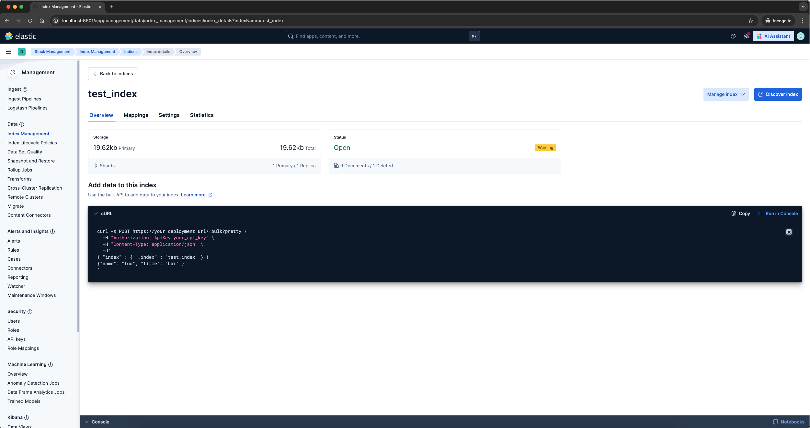
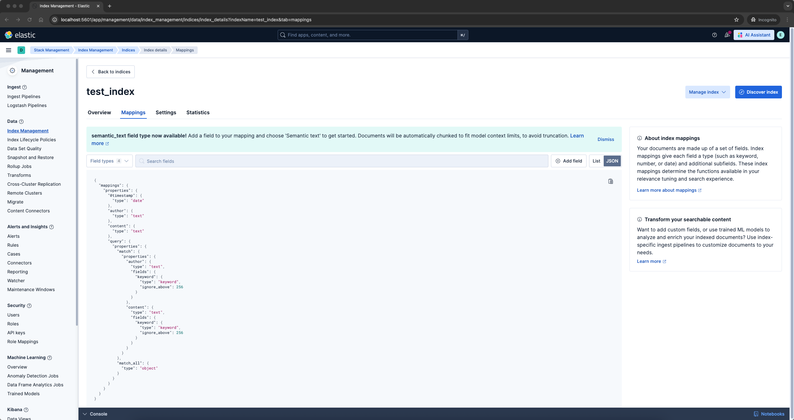
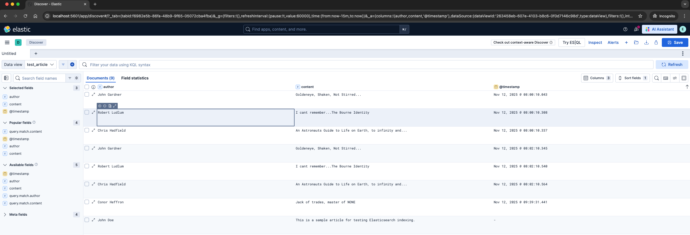

# elastic-tester

[](https://opensource.org/licenses/Apache-2.0)

[](https://github.com/conorheffron/elastic-tester/actions/workflows/maven.yml)

## Overview
- Tool for testing elastic (ES, formerly elastic search) instance by storing `No-SQL` JSON documents by index (ES / Kibana instance setup required).

## Technologies Used
- JDK 22, Elastic 9 (formerly Elastic Search)

# Program Arguments
```shell
<elastic-search-instance-url> <index> <elastic_username> <elastic_password> <inserts_needed>
```

## Build Project
```shell
./mvnw clean compile assembly:single
```

## Usage Example
```shell
java -Djavax.net.ssl.trustStore=$TRUSTSTORE \
    -Djavax.net.ssl.trustStorePassword=$TRUSTPASS \
    -cp target/elastic-search-tester-3.5.6-RELEASE-jar-with-dependencies.jar net.ironoc.elastic.ElasticApp \
    "https://localhost:9200/" test_index elastic $ELASTIC_PASSWORD false
```

### Example Console Output
```
* START MATCH ALL QUERY FOR JEST RESULT SET---------------------------------------*
-------------- JEST Search raw JSON Object: 
{
  "took": 1,
  "timed_out": false,
  "_shards": {
    "total": 1,
    "successful": 1,
    "skipped": 0,
    "failed": 0
  },
  "hits": {
    "total": {
      "value": 8,
      "relation": "eq"
    },
    "max_score": 1.0,
    "hits": [
      {
        "_index": "test_index",
        "_id": "SlIUd5oB-RdhffL6TG1L",
        "_score": 1.0,
        "_source": {
          "author": "Robert Ludlum",
          "content": "I cant remember...The Bourne Identity",
          "@timestamp": "2025-11-12T08:00:10.308Z"
        }
      },
      {
        "_index": "test_index",
        "_id": "S1IUd5oB-RdhffL6TG1p",
        "_score": 1.0,
        "_source": {
          "author": "Chris Hadfield",
          "content": "An Astronauts Guide to Life on Earth, to infinity and...",
          "@timestamp": "2025-11-12T08:00:10.337Z"
        }
      },
      {
        "_index": "test_index",
        "_id": "TVIWd5oB-RdhffL6IW33",
        "_score": 1.0,
        "_source": {
          "author": "Robert Ludlum",
          "content": "I cant remember...The Bourne Identity",
          "@timestamp": "2025-11-12T08:02:10.540Z"
        }
      },
      {
        "_index": "test_index",
        "_id": "TlIWd5oB-RdhffL6Im0K",
        "_score": 1.0,
        "_source": {
          "author": "Chris Hadfield",
          "content": "An Astronauts Guide to Life on Earth, to infinity and...",
          "@timestamp": "2025-11-12T08:02:10.564Z"
        }
      },
      {
        "_index": "test_index",
        "_id": "SVIUd5oB-RdhffL6S22G",
        "_score": 1.0,
        "_source": {
          "author": "John Gardner",
          "content": "Goldeneye, Shaken, Not Stirred...",
          "@timestamp": "2025-11-12T08:00:10.043Z"
        }
      },
      {
        "_index": "test_index",
        "_id": "1",
        "_score": 1.0,
        "_source": {
          "author": "John Doe",
          "content": "This is a sample article for testing Elasticsearch indexing."
        }
      },
      {
        "_index": "test_index",
        "_id": "TFIWd5oB-RdhffL6IW3R",
        "_score": 1.0,
        "_source": {
          "author": "John Gardner",
          "content": "Goldeneye, Shaken, Not Stirred...",
          "@timestamp": "2025-11-12T08:02:10.345Z"
        }
      },
      {
        "_index": "test_index",
        "_id": "_search",
        "_score": 1.0,
        "_source": {
          "query": {
            "match": {
              "author": "John Doe"
            }
          }
        }
      }
    ]
  }
}
* END MATCH ALL QUERY ---------------------------------------*
* START DIRECT MATCH QUERY FOR MODEL RESULTS ---------------------------------------*
--------------
{
  "took": 1,
  "timed_out": false,
  "_shards": {
    "total": 1,
    "successful": 1,
    "skipped": 0,
    "failed": 0
  },
  "hits": {
    "total": {
      "value": 8,
      "relation": "eq"
    },
    "max_score": 1.0,
    "hits": [
      {
        "_index": "test_index",
        "_id": "SlIUd5oB-RdhffL6TG1L",
        "_score": 1.0,
        "_source": {
          "author": "Robert Ludlum",
          "content": "I cant remember...The Bourne Identity",
          "@timestamp": "2025-11-12T08:00:10.308Z"
        }
      },
      {
        "_index": "test_index",
        "_id": "S1IUd5oB-RdhffL6TG1p",
        "_score": 1.0,
        "_source": {
          "author": "Chris Hadfield",
          "content": "An Astronauts Guide to Life on Earth, to infinity and...",
          "@timestamp": "2025-11-12T08:00:10.337Z"
        }
      },
      {
        "_index": "test_index",
        "_id": "TVIWd5oB-RdhffL6IW33",
        "_score": 1.0,
        "_source": {
          "author": "Robert Ludlum",
          "content": "I cant remember...The Bourne Identity",
          "@timestamp": "2025-11-12T08:02:10.540Z"
        }
      },
      {
        "_index": "test_index",
        "_id": "TlIWd5oB-RdhffL6Im0K",
        "_score": 1.0,
        "_source": {
          "author": "Chris Hadfield",
          "content": "An Astronauts Guide to Life on Earth, to infinity and...",
          "@timestamp": "2025-11-12T08:02:10.564Z"
        }
      },
      {
        "_index": "test_index",
        "_id": "SVIUd5oB-RdhffL6S22G",
        "_score": 1.0,
        "_source": {
          "author": "John Gardner",
          "content": "Goldeneye, Shaken, Not Stirred...",
          "@timestamp": "2025-11-12T08:00:10.043Z"
        }
      },
      {
        "_index": "test_index",
        "_id": "1",
        "_score": 1.0,
        "_source": {
          "author": "John Doe",
          "content": "This is a sample article for testing Elasticsearch indexing."
        }
      },
      {
        "_index": "test_index",
        "_id": "TFIWd5oB-RdhffL6IW3R",
        "_score": 1.0,
        "_source": {
          "author": "John Gardner",
          "content": "Goldeneye, Shaken, Not Stirred...",
          "@timestamp": "2025-11-12T08:02:10.345Z"
        }
      },
      {
        "_index": "test_index",
        "_id": "_search",
        "_score": 1.0,
        "_source": {
          "query": {
            "match": {
              "author": "John Doe"
            }
          }
        }
      }
    ]
  }
}
Article [author=Robert Ludlum, content=I cant remember...The Bourne Identity, timestamp=2025-11-12T08:00:10.308Z]
Article [author=Chris Hadfield, content=An Astronauts Guide to Life on Earth, to infinity and..., timestamp=2025-11-12T08:00:10.337Z]
Article [author=Robert Ludlum, content=I cant remember...The Bourne Identity, timestamp=2025-11-12T08:02:10.540Z]
Article [author=Chris Hadfield, content=An Astronauts Guide to Life on Earth, to infinity and..., timestamp=2025-11-12T08:02:10.564Z]
Article [author=John Gardner, content=Goldeneye, Shaken, Not Stirred..., timestamp=2025-11-12T08:00:10.043Z]
Article [author=John Doe, content=This is a sample article for testing Elasticsearch indexing., timestamp=null]
Article [author=John Gardner, content=Goldeneye, Shaken, Not Stirred..., timestamp=2025-11-12T08:02:10.345Z]
Article [author=null, content=null, timestamp=null]
* END DIRECT MATCH QUERY ---------------------------------------*
* START DIRECT MATCH QUERY FOR ES RESULTS ---------------------------------------*
--------------
{
  "took": 1,
  "timed_out": false,
  "_shards": {
    "total": 1,
    "successful": 1,
    "skipped": 0,
    "failed": 0
  },
  "hits": {
    "total": {
      "value": 2,
      "relation": "eq"
    },
    "max_score": 1.1631508,
    "hits": [
      {
        "_index": "test_index",
        "_id": "S1IUd5oB-RdhffL6TG1p",
        "_score": 1.1631508,
        "_source": {
          "author": "Chris Hadfield",
          "content": "An Astronauts Guide to Life on Earth, to infinity and...",
          "@timestamp": "2025-11-12T08:00:10.337Z"
        }
      },
      {
        "_index": "test_index",
        "_id": "TlIWd5oB-RdhffL6Im0K",
        "_score": 1.1631508,
        "_source": {
          "author": "Chris Hadfield",
          "content": "An Astronauts Guide to Life on Earth, to infinity and...",
          "@timestamp": "2025-11-12T08:02:10.564Z"
        }
      }
    ]
  }
}
* END DIRECT MATCH QUERY ---------------------------------------*
```

---

## `Local Instance of Elastic` with the same setup & data for testing

### Test Index


### Mapping


### Data View


- `Mappings JSON`
```json
{
  "mappings": {
    "properties": {
      "@timestamp": {
        "type": "date"
      },
      "author": {
        "type": "text"
      },
      "content": {
        "type": "text"
      },
      "query": {
        "properties": {
          "match": {
            "properties": {
              "author": {
                "type": "text",
                "fields": {
                  "keyword": {
                    "type": "keyword",
                    "ignore_above": 256
                  }
                }
              },
              "content": {
                "type": "text",
                "fields": {
                  "keyword": {
                    "type": "keyword",
                    "ignore_above": 256
                  }
                }
              }
            }
          },
          "match_all": {
            "type": "object"
          }
        }
      }
    }
  }
}
```
